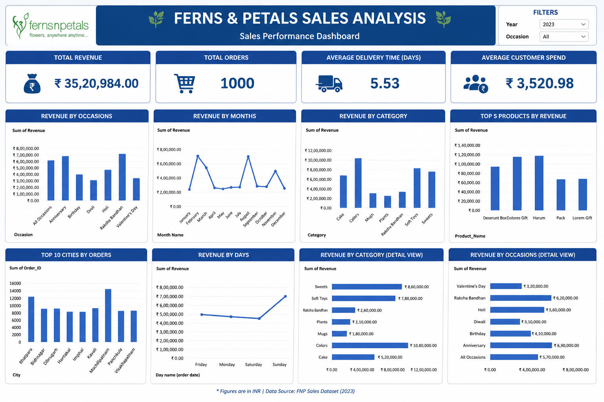

# 🌸 Ferns & Petals Sales Analysis Dashboard

## 📌 Project Overview

This project analyzes sales data from **Ferns & Petals (FNP)**, a gifting company specializing in occasion-based gift delivery such as Diwali, Valentine's Day, Birthdays, Anniversaries, and Raksha Bandhan.

Using **Advanced Excel**, an interactive dashboard was built to monitor sales performance, customer behavior, delivery efficiency, and product trends, enabling business stakeholders to make data-driven decisions.

---

# Dashboard Preview



---

# Business Problem

Ferns & Petals wanted to understand:

- Which occasions generate the highest revenue?
- Which products contribute the most sales?
- Which cities place the highest number of orders?
- How long does delivery take?
- How much does each customer spend on average?

The objective was to transform raw sales data into actionable business insights using an interactive dashboard.

---

# Dataset

- Orders Analyzed: **1,000**
- Revenue: **₹35,20,984**
- Tool Used: **Advanced Excel**

---

# KPIs

- Total Revenue
- Average Customer Spend
- Average Delivery Time
- Monthly Sales Trend
- Revenue by Occasion
- Product Category Performance
- Top 5 Products
- Top 10 Cities

---

# Dashboard Features

- Interactive Slicers
- Pivot Tables
- Pivot Charts
- KPI Cards
- Dynamic Filtering

---

# Key Business Insights

### Revenue

- Total Revenue reached **₹35.2 Lakhs**

### Customer Behavior

- Average customer spend was **₹3,520**

### Delivery Performance

- Average delivery time was **5.53 days**

### Product Performance

- Top-selling products generated the majority of total revenue.

### Occasion Analysis

- Seasonal occasions significantly influenced revenue distribution.

---

# Business Recommendations

✅ Increase inventory before high-demand occasions.

✅ Improve logistics in cities with longer delivery times.

✅ Focus marketing campaigns on high-performing occasions.

✅ Promote best-selling products using targeted offers.

---

# Skills Demonstrated

- Advanced Excel
- Dashboard Design
- Pivot Tables
- Pivot Charts
- KPI Reporting
- Business Analytics

---

## 📁 Repository Structure

```text
ferns-petals-sales-analysis/
│
├── README.md
├── dashboard.png
├── PROJECT_excel.xlsx
└── Ferns and Petals Sales Analysis.pdf
```

---

# Author

**Anisha Saini**
